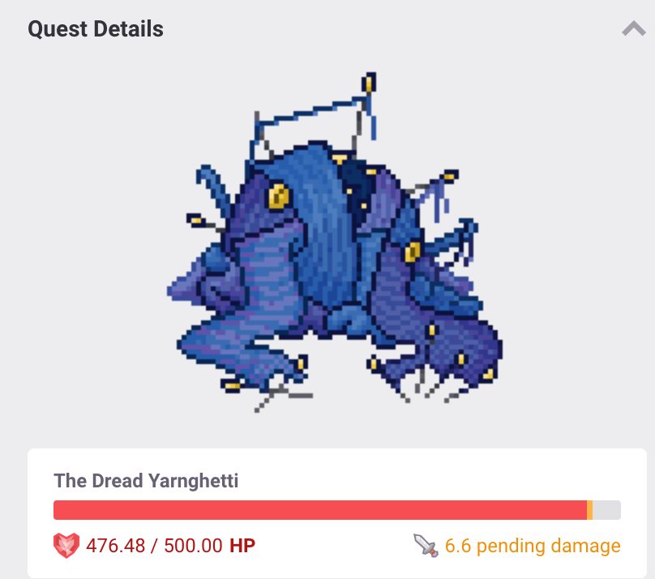
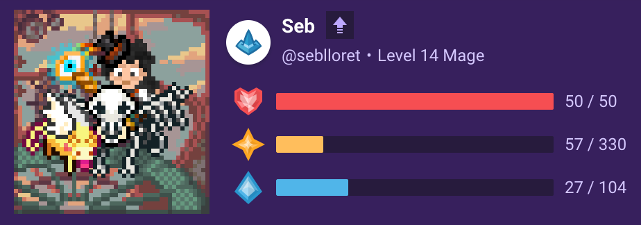
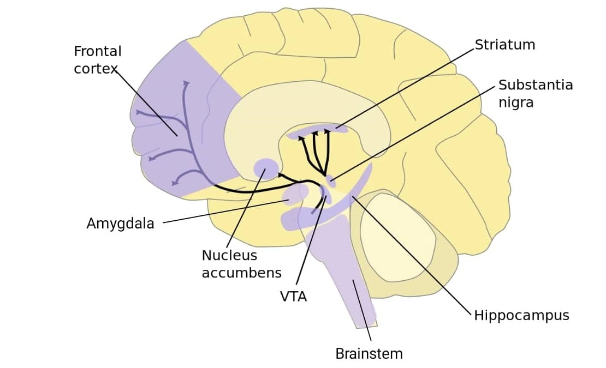

## tl;dr
hey there! in this post, i'm diving into something that's really helped me find motivation for daily chores - gamifying tasks. i've been using [habitica](https://habitica.com/) as a cross-platform, free (with no ads!) way to organize my habits and to-dos. it's a pretty simple concept that requires nothing besides a small time investment and healthy dose of being honest with yourself. 

## personal discovery
it all started with weightlifting. tracking my progress through reps and weights showed me how satisfying it is to see direct results from my efforts. this got me thinking - why not apply this to other stuff in life?

## the challenge of adhd
having adhd can make it tricky to stick with things, especially when the payoff isn't right there in front of you. take something like job hunting - it's full of unknowns and things you can't control, which can cause a vicious, self-reinforcing cycle of demotivation.

## gamification as a solution

to deal with this ambiguity, i turned to habitica. with it, i set up my daily tasks, habits i want to form, and the big to-dos. every time i check something off, i get rewards in the game - like gold, xp, or eggs that hatch into pets and mounts. it provides a cute little abstraction to metrics i care about for nailing my tasks!

## practical examples
for example, with job hunting, i set myself little challenges - like sending x number of applications a week and then treating myself when i hit that target. it's about celebrating the small wins, you know?

## the psychology behind gamification

now, let's nerd out a bit on why this gamification thing works, especially from a brain perspective. at the heart of it all is this tiny part of our brain called the ventral tegmental area, or VTA. this little fella is super important in the reward system of our brains.

every time we do something that our brain considers rewarding, like getting points and having a sound play in a game when you tick off a task, the VTA gets activated. it releases dopamine, a neurotransmitter of motivation and potential. this dopamine rush is what gives us that sweet sense of satisfaction and accomplishment.

but here's where it gets even more interesting. the VTA doesn't just play a role in feeling good in the moment; it's also key in habit formation and, on the flip side, addiction. when we get that dopamine hit, our brain starts to recognize the actions that led to it. over time, this forms habits - our neurons are essentially biological machines that want to respond in whichever way is most predictable. when we form associations between completing tasks and getting positive stimuli we reinforce these connections we want to nurture.

in the context of ADHD, where it can be tough to stay motivated or stick with habits, leveraging the VTA's response to rewards can be a game-changer. by gamifying tasks, we're essentially hacking our brain's reward system. we're making the mundane or challenging tasks rewarding, thereby encouraging our brain to see these tasks as something to look forward to, rather than avoid and put off.

so, while Habitica and similar tools might seem like just fun and games, they're actually tapping into some pretty deep neurological processes, helping to form positive habits and keep us engaged, even when tasks feel overwhelming or tedious.

## tips for readers
if you wanna give this a go, start with something small. pick a task, set some easy goals, and think up some fun rewards. it's all about making things a bit more fun and rewarding yourself along the way.